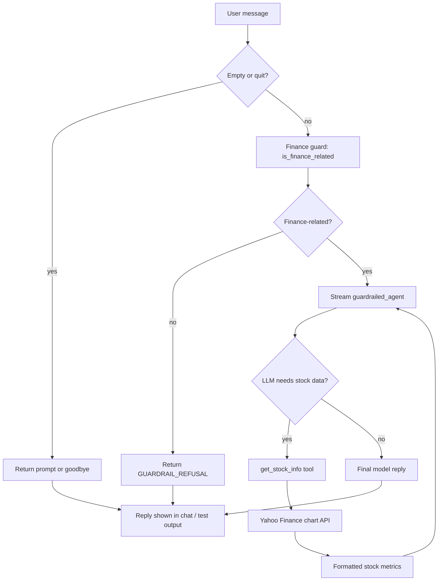
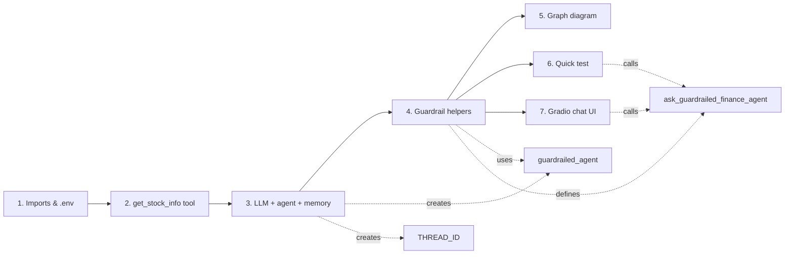
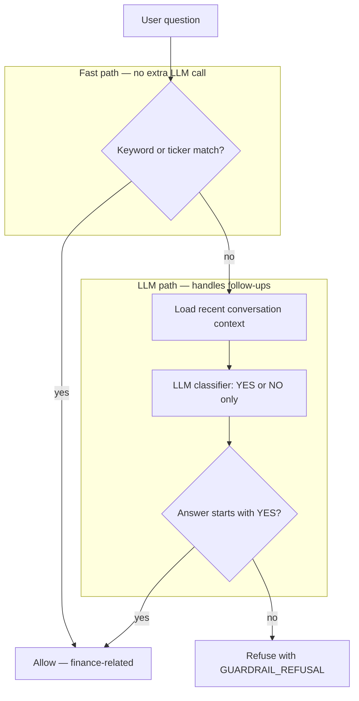
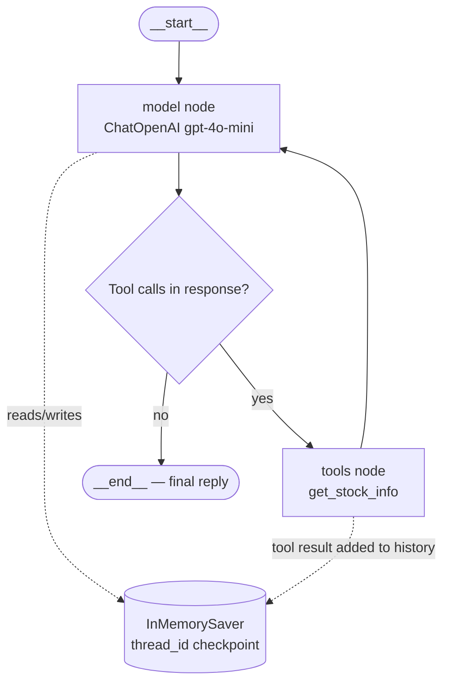
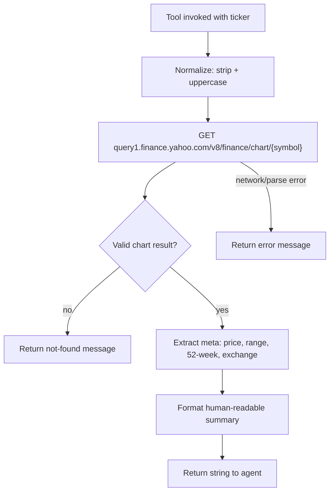
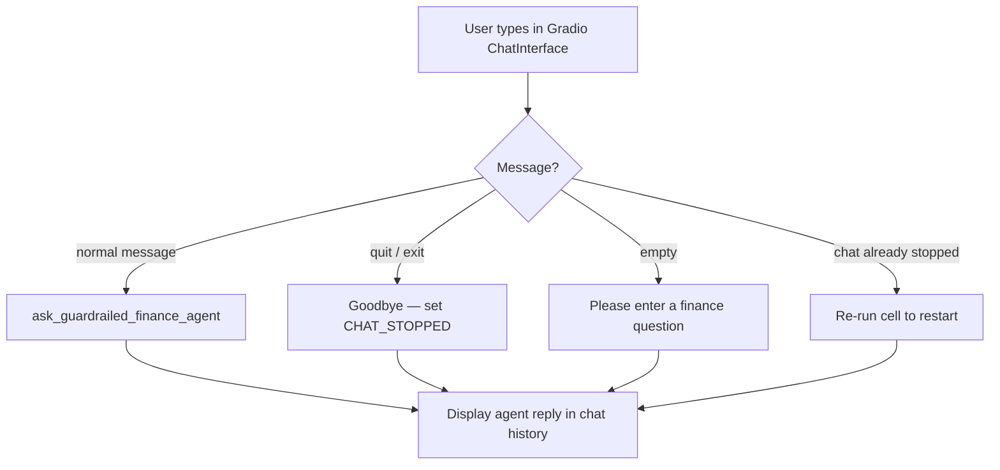

# Finance AI Agent

A conversational finance assistant built with **LangChain** and **OpenAI**. The agent uses one stock lookup tool, remembers conversation history for follow-up questions, and only responds to finance-related queries.

## Features

- OpenAI LLM (`gpt-4o-mini`) for understanding and responding to user questions
- Single `get_stock_info` tool powered by the Yahoo Finance chart API via `requests` (no extra API key required)
- **Conversation memory** — follow-up questions like *"What about Microsoft?"* work in context
- **Finance-only guard** — non-finance questions are politely rejected before the agent runs
- Interactive **chat window** (Gradio) embedded in the notebook output
- API key loaded securely from a local `.env` file

## Project Structure

```
finance_agent/
├── .env                      # Your OpenAI API key (not committed to git)
├── finance_agent.ipynb       # Main notebook — run this
├── requirements.txt          # Python dependencies
└── README.md                 # This file
```

## Setup

### 1. Create a virtual environment (recommended)

```bash
python -m venv venv

# Windows
venv\Scripts\activate

# macOS / Linux
source venv/bin/activate
```

### 2. Install dependencies

```bash
pip install -r requirements.txt
```

### 3. Configure your OpenAI API key

Create or edit `.env` in the project root:

```
OPENAI_API_KEY=your_openai_api_key_here
```

> **Note:** Never commit `.env` to version control.

### 4. Open the notebook

Open `finance_agent.ipynb` in **Cursor/VS Code** (with the Python extension), or launch Jupyter:

```bash
python -m notebook finance_agent.ipynb
```

Run all cells in order, then ask finance questions when prompted. See [Notebook Walkthrough](#notebook-walkthrough-finance_agentipynb) for section-by-section details and flow diagrams.

## Example Questions

- "What is Apple's current stock price?"
- "Show me key info for MSFT"
- "Compare that with Google" *(follow-up — uses chat memory)*

Type `quit` or `exit` to stop the chat loop.

## Notebook Walkthrough (`finance_agent.ipynb`)

The notebook is the entire application. Run cells **top to bottom** in order. Each section builds on the previous one.

| Section | What it does |
|---------|--------------|
| **Intro** | Overview of features and prerequisites |
| **1. Imports & environment** | Loads dependencies and `OPENAI_API_KEY` from `.env` |
| **2. Finance tool** | Defines `get_stock_info` — Yahoo Finance chart API lookup |
| **3. Agent & memory** | Creates `ChatOpenAI`, `InMemorySaver`, and the LangChain agent |
| **4. Guardrailed helper** | Finance-only classifier + `ask_guardrailed_finance_agent()` entry point |
| **5. Agent graph** | Renders the LangGraph Mermaid diagram inside the notebook |
| **6. Quick test** | Optional smoke tests (finance, follow-up, off-topic) |
| **7. Interactive chat** | Gradio chat UI embedded in notebook output |

### Key components

| Component | Role |
|-----------|------|
| `get_stock_info` | LangChain `@tool` — fetches live price, day range, 52-week high/low from Yahoo Finance |
| `guardrailed_agent` | LangChain agent (`create_agent`) with system prompt, one tool, and memory checkpointer |
| `THREAD_ID` / `AGENT_CONFIG` | Unique session ID so all turns share the same conversation thread |
| `is_finance_related()` | Two-stage guard: fast keyword/ticker regex, then LLM YES/NO classifier with recent context |
| `ask_guardrailed_finance_agent()` | Main handler — guard check → stream agent → return final reply |
| `finance_chat_respond()` | Gradio callback — wraps the guardrailed agent for the chat UI |

### Dependencies used in the notebook

| Package | Purpose |
|---------|---------|
| `langchain` / `langgraph` | Agent creation, graph execution, in-memory checkpointing |
| `langchain-openai` | `ChatOpenAI` model (`gpt-4o-mini`) |
| `python-dotenv` | Load `OPENAI_API_KEY` from `.env` |
| `requests` | Yahoo Finance chart API calls (no extra API key) |
| `gradio` | Inline chat interface in the notebook |

## How It Works

### End-to-end request flow

Every user message — whether from the test cell or the Gradio chat — follows this path:



### Notebook execution order

Run these sections sequentially. Later cells depend on objects created earlier.



### Finance guard (two-stage classifier)

Off-topic questions are blocked **before** the agent runs, saving tokens and keeping responses on-topic.



The fast path matches finance keywords (`stock`, `invest`, `market`, …) and plausible ticker symbols (2–5 uppercase letters, excluding common English words). The LLM path uses up to six recent messages so follow-ups like *"How does Microsoft compare?"* are classified correctly even without obvious keywords.

### LangChain agent graph (model ↔ tools loop)

Inside the notebook, section **5** builds the graph with `draw_mermaid()` and displays it as a PNG image in the cell output. Conceptually, the agent alternates between the LLM and tools until it produces a final answer:



The checkpointer stores all messages for the session `thread_id`, so follow-up questions retain context across turns.

### Stock tool (`get_stock_info`)



Returned fields include company name, current price, previous close, day change (%), day range, 52-week high/low, and exchange.

### Gradio chat loop

Section **7** embeds the chat UI with `chat_ui.launch(inline=True)`:



Example prompts are pre-loaded in the UI, including one off-topic question to demonstrate the guardrail.

### Troubleshooting: Mermaid graph rendering

| Symptom | Cause | Fix |
|---------|-------|-----|
| Raw Mermaid text instead of a diagram | `display(Markdown("```mermaid..."))` is not rendered as a chart in Cursor/VS Code notebooks | Section **5** uses `display(Image(...))` with a PNG from mermaid.ink |
| `SSLCertVerificationError` on `draw_mermaid_png()` | LangChain's default PNG helper validates SSL; corporate proxies often break that | Section **5** uses a custom `render_mermaid_png()` with `verify=False` for the image request only |
| PNG still fails (no internet / CDN blocked) | mermaid.ink unreachable | Copy `agent_graph.draw_mermaid()` output into [mermaid.live](https://mermaid.live) |

### Cell reference (quick map)

| Cells | Function |
|-------|----------|
| 0 | Markdown intro |
| 1–2 | Imports, `load_dotenv()`, validate API key |
| 3–4 | `YAHOO_HEADERS`, `@tool get_stock_info` |
| 5–6 | `ChatOpenAI`, `InMemorySaver`, `create_agent`, `THREAD_ID` |
| 7–8 | Guardrail constants, `is_finance_related`, `ask_guardrailed_finance_agent` |
| 9–10 | Render LangGraph Mermaid diagram in notebook |
| 11–12 | Optional tests: AAPL price, MSFT follow-up, weather rejection |
| 13–14 | Gradio `ChatInterface` with inline launch |

## Requirements

- Python 3.10+
- OpenAI API key with access to chat models
- Internet connection (for OpenAI and Yahoo Finance data)

## Disclaimer

This agent provides general market data for educational purposes only. It is **not** financial advice. Always consult a qualified professional before making investment decisions.
